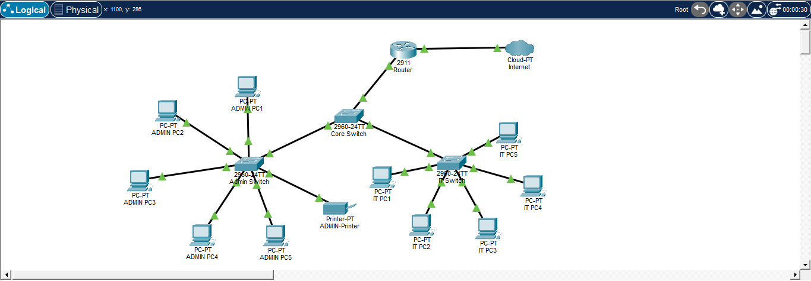

# enterprise-vlan-network

Enterprise network simulation using Cisco Packet Tracer with VLAN segmentation, Router-on-a-Stick inter-VLAN routing, and shared network resources.

## 🗺️ Network Topology Overview
* **Inter-VLAN Routing:** Router-on-a-Stick (ROAS) architecture using subinterfaces to route traffic between isolated networks.
* **VLAN Segmentation:** Distinct broadcast domains created via VLAN 10 (Administration) and VLAN 20 (IT) for security.
* **Trunking Highways:** Configured 802.1Q trunk links between switches to allow multi-VLAN traffic to flow seamlessly.

## 🛠️ Skills Demonstrated & Verified
* **Cisco IOS Configuration:** Configured routers, core switches, and edge switches using standard Cisco CLI commands.
* **VLAN & Port Assignment:** Properly assigned end devices (PCs and Printers) to specific access VLANs.
* **Network Troubleshooting:** Diagnosed and resolved standard configuration anomalies, including port range gaps and Spanning Tree (STP) native VLAN mismatches.

## 🚀 Verification Testing
All implementations were verified via command-line ping testing to ensure full connectivity across the network fabric:
* **Intra-VLAN Connectivity:** Administration PCs successfully communicate within VLAN 10.
* **Intra-VLAN Connectivity:** IT PCs successfully communicate within VLAN 20.
* **Inter-VLAN Routing:** Cross-department communication between VLAN 10 and VLAN 20 is fully functional via Router-on-a-Stick.
* **Shared Resource Access:** Both departments can successfully reach and utilize the shared network printer on port Fa0/6.
